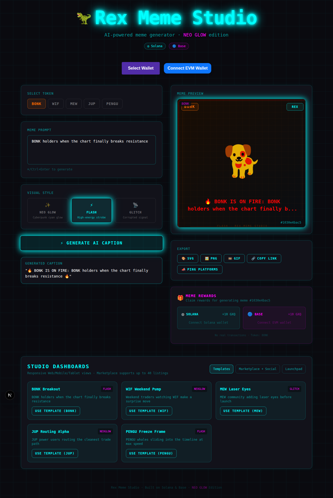
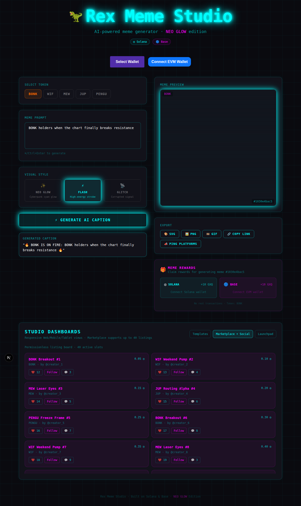
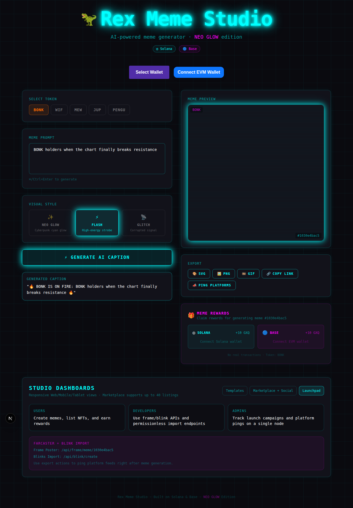

# 🦖 REX Meme Studio
**Production-grade NFT Meme Studio for Web/Mobile/Tablet responsive experiences with Solana + Base flows, marketplace/social tooling, and Farcaster/Blinks distribution.**

REX Meme Studio is a modular monorepo for flash-style NFT meme generation, sharing, and growth automation.

---

## 🚀 Implemented Feature Coverage

### Core Studio
- AI caption-driven meme generation with deterministic rendering
- Dynamic SVG/PNG meme rendering on Unix-based environments
- Flash/NeoGlow/Glitch visual effects
- Premade NFT templates for one-click setup
- Export actions: SVG, PNG, GIF stub, share links

### Marketplace + Social
- Marketplace dashboard with **up to 40 listings**
- Social interactions: **like**, **follow creator**, **comment counter**
- Permissionless listing board UI patterns for creator communities

### Launchpad + Roles
- Unified launchpad dashboard for **Users / Developers / Admins**
- Single-node oriented operational surface for meme creation and distribution workflows
- Solana + Base reward panel integration hooks

### Farcaster + Blinks + Marketing
- Farcaster frame poster endpoints
- Blinks-friendly import endpoints
- Post-generation **platform ping API** for marketing fan-out automation

---

## 🖼️ Dashboard Screenshots

### Templates + Generation Dashboard


### Marketplace + Social Dashboard


### Launchpad Dashboard


---

## 🔗 Integration Endpoints

- Blink import: `GET /api/blink/create`
- Blink meme action: `GET /api/blink/meme/:id`
- Farcaster frame poster: `GET /api/frame/meme/:id`
- Meme renderer: `GET|POST /api/meme/render`
- Marketing ping automation: `POST /api/marketing/ping`

---

## 📦 Tech Stack
| Layer | Technology |
|-------|------------|
| Frontend | Next.js, React, TypeScript, Tailwind |
| Wallets | Solana Wallet Adapter, RainbowKit/Wagmi |
| Meme Engine | `packages/meme-engine` (template + style rendering) |
| Rewards | `packages/rewards` (Solana/Base service stubs) |
| Distribution | Farcaster Frames + Solana Blinks APIs |
| Build/Lint | Turborepo + TypeScript + ESLint |

---

## 🛠️ Local Development

```bash
corepack enable
corepack prepare pnpm@9.15.9 --activate
pnpm install
pnpm dev
```

Open `http://localhost:3000`.

### Validation
```bash
pnpm lint
pnpm build
pnpm test
```
